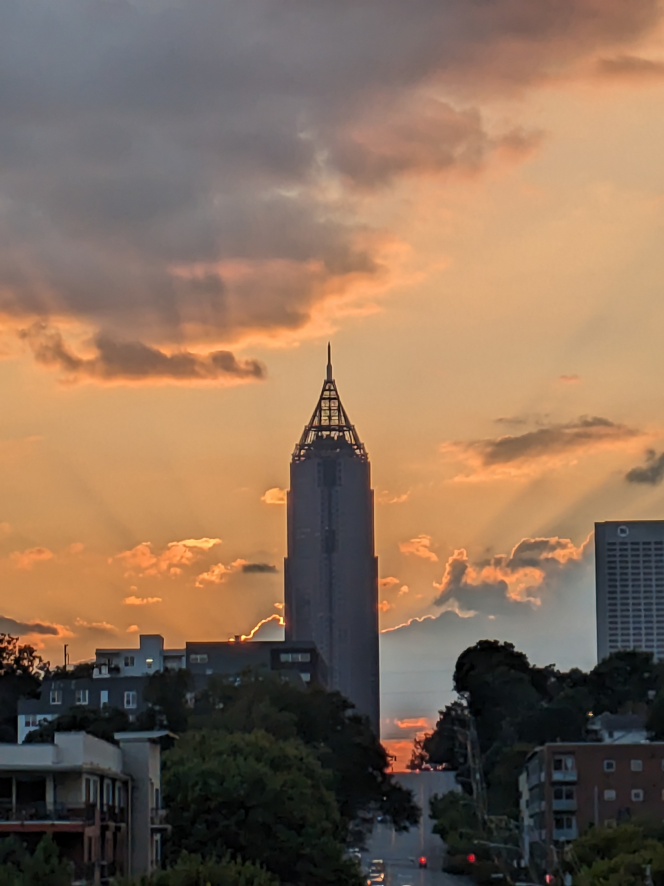

# OSINT

## Under The Bridge

*Can you find this iconic location?*

*Connect here:* [https://osint.golf/HuntressCTF2023-chall2/](https://osint.golf/HuntressCTF2023-chall2)
### Walkthrough

From the initial location, we confirm this is in the United Kingdom based on the license plates and street signs:


On the left, there is a sign for "HC13" which is the "[Rick Roll bridge](https://www.google.co.uk/maps/@51.512526,-0.2189526,3a,75y,53.01h,90.8t/data=!3m6!1e1!3m4!1sXyG9YIV2tv-XcCXWtBwqKw!2e0!7i16384!8i8192?entry=ttu)":


```
flag{fdc8cd4cff2c19e0d1022e78481ddf36}
```

## Operation Not Found

*In the boundless web of data, some corners echo louder than others, whispering tales of innovation, deep knowledge, and fierce competition. On the lush landscapes of [https://osint.golf/](https://osint.golf/), a corner awaits your discovery... where intellect converges with spirit, and where digital foundations stand alongside storied arenas.*

*Connect here:* [https://osint.golf/HuntressCTF2023-chall1/](https://osint.golf/HuntressCTF2023-chall1)

### Walkthrough

From the initial location, we see a sign for "*Brasfield & Gorrie*". Googling for this company shows they are a construction and planning company working on the "[Crosland Tower](https://www.google.com/maps/place/Crosland+Tower/@33.7682772,-84.4045447,14z/data=!3m1!5s0x88f504620fdf5207:0xfe60772932020a8d!4m6!3m5!1s0x88f5046214c464db:0x773097177cbff905!8m2!3d33.7740921!4d-84.3950282!16s%2Fg%2F11csp7zzf1?entry=ttu)" at the Georgia Institute of Technology which gives us the flag:


```
flag{c46b7183c981ec4cddb31b2fdc6a914c}
```

## Where am I?

*Your friend thought using a JPG was a great way to remember how to login to their private server. Can you find the flag?*

File: [PXL_20230922_231845140_2.jpg](challenge_files/PXL_20230922_231845140_2.jpg)



### Walkthrough

From the challenge prompt, we can infer there is encoded data within this image. Using `exiftool`, we see a Base64 encoded string within the `Image Description` field:

```console
$ exiftool PXL_20230922_231845140_2.jpg
...
Image Description               : ZmxhZ3tiMTFhM2YwZWY0YmMxNzBiYTk0MDljMDc3MzU1YmJhMik=
...
```

Decoding this from Base64 reveals the flag:

```console
$ echo 'ZmxhZ3tiMTFhM2YwZWY0YmMxNzBiYTk0MDljMDc3MzU1YmJhMik=' | base64 -d
flag{b11a3f0ef4bc170ba9409c077355bba2)
```